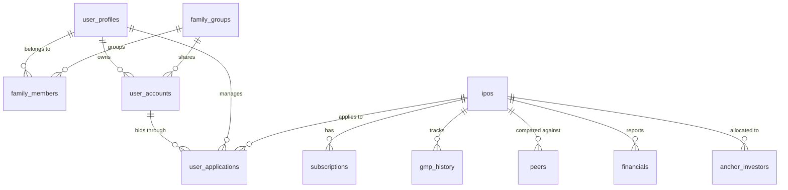

# Case Study: Antigravity IPO Tracker
## Bridging Product Design, Algorithmic Backtesting, and Resilient Engineering

---

## 1. Executive Summary & Project Vision

### 1.1 The Origin & Investment Thesis
The **Antigravity IPO Tracker** began not as a corporate project, but as a personal financial experiment. The creator, a Product Designer transitioning into a Product Engineer (Builder), noticed a major inefficiency in their personal investing habits: they applied to IPOs sporadically (10–12 times over two years) but only received allotments once or twice. Navigating the decision-making process meant watching hours of speculative YouTube analysis videos—a highly time-consuming, emotional, and inconsistent process.

The goal was simple: **Design a programmatic system to bid on the next 100 Indian Mainboard IPOs over a 6 to 8-month timeframe using a total capital pool of ₹1 Lakh (100,000 INR), aiming to maximize listing-day returns through structured, unemotional rules.**

To realize this, the tool acts as a listing gain harvester:
- Scraping financial aggregators for real-time demand and informal grey market premiums.
- Running a hard decision engine based on **8 quantitative metrics**.
- Giving a strict **YES/NO** bidding recommendation on closing day.
- Recyclability: Selling 100% of the allocated shares on listing morning and immediately rotating the capital back into the ASBA (Applications Supported by Blocked Amount) pool.

```
+------------------+     +------------------------+     +---------------------+
|  Gather Data     | --> |   Decision Engine      | --> |   Capital Rotator   |
|  - Subscriptions |     |   - 8 Scoring Metrics  |     |   - Lock T+2 Funds  |
|  - Live GMP      |     |   - 2 Mandatory Gates  |     |   - Family PAN Slots|
+------------------+     +------------------------+     +---------------------+
```

### 1.2 The Initial Prompt
The journey started with a conversational prompt to the Antigravity AI mode, articulating a raw vision that would later mature into a production-grade IDE project:

> **The Initial Prompts:**
> *"Hey chat, I have a project idea in my mind. It's quite rough right now but I would love to hear your thoughts on it before building it out.*
>
> *The idea is I want to experiment by purchasing 100 IPOs in the next 6 to 8 months, probably in India. I want to invest around ₹1 lakh in the market and use this tool to analyze all the IPOs that are coming in the market from different sectors on the basis of different metrics.*
>
> *Suppose there's an IPO coming up next week. I want this tool to analyze that IPO. Give me a yes or no at the end: should I invest in it or not? I want to do it very strategically because this is a financial decision that I'm taking so I should be very particular about this.*
>
> *This tool should analyze that IPO with different metrics like grey market premium, subscriptions, pros and cons. We can fetch this kind of information from outside sources that are putting it out there. I would love to hear some of the things like who has invested in this IPO during that timeframe. What does the company look like? What financial decisions has it taken in the past year or so?*
>
> *This is the basic idea I have in my mind right now. It should give me notifications when these IPOs are coming up and give a basic analysis. On the last day of the IPO we can invest if this tool suggests that to us. If not we can move on to the next one..."*

---

## 2. Product Design & UX Highlights

### 2.1 The Capital Rotator Slider & Visual Wallet
As a product designer, the creator knew that listing data was only half the problem. The core operational constraint was **capital lockup**. 

When applying for an IPO in India via ASBA, the bank blocks the subscription amount (minimum ₹14,000–₹15,000 per lot) until the allotment date (typically 2–3 days). If you are not allotted shares, the bank refunds the blocked cash. In a crowded week where 4 or 5 hot IPOs close in parallel, a retail investor with a fixed ₹1 Lakh budget cannot blindly bid on all of them.

The **Capital Rotator** panel was designed to solve this layout visually:
*   **Visual Wallet Allocation:** Shows exactly how much capital is "Liquid," "Blocked" in ASBA, and "Realized Gains."
*   **Time-Series Calendar Mapping:** Maps the overlapping T+2 block timelines so the user knows exactly when capital from a previous bid will return to the liquid pool.
*   **Simulation Sliders:** In the backtester, users adjust sliders to simulate how a strict capital cap of ₹1 Lakh restricts their capability to bid on overlapping IPOs, demonstrating the necessity of efficient rotation.

```
₹100,000 Total Capital
├─ Blocked (IPO A - T+2):  [▓▓▓▓▓▓▓▓▓▓▓▓▓░░░]  ₹15,000
├─ Blocked (IPO B - T+3):  [▓▓▓▓▓▓▓▓▓▓▓▓▓▓▓▓]  ₹15,000
└─ Liquid / Available:     [░░░░░░░░░░░░░░░░]  ₹70,000 (Fits ~4 more bids)
```

### 2.2 Family PAN Rotation Strategy (Slot-Based Bidding)
One of the key UX breakthroughs was designing for the **SEBI Allotment Rule**. Under Indian market regulations, when a retail IPO category is oversubscribed, the allotment algorithm prioritizes allocating **exactly one minimum lot to as many unique PAN (Permanent Account Number) accounts as possible** before distributing multiple lots.

Therefore:
*   *Inefficient Strategy:* Bidding ₹75,000 (5 lots) from a single account in a hot IPO. The probability of getting allotted remains identical to bidding 1 lot.
*   *Optimized Strategy:* Bidding ₹15,000 (1 lot) across **5 unique family accounts** (e.g., the user, their brother, parents). This multiplies the allotment probability by 5x while using the exact same capital pool.

The system was designed to track **slots** (family accounts) rather than a raw capital pool. Users can log into the dashboard, assign family members to their group, register separate PAN/Demat accounts, and allocate specific applications to different accounts to optimize the lottery hit rate.

---

## 3. Database Design & Evolution

The project's database architecture evolved from a simple offline flat-file to a production-grade relational cloud database.



### 3.1 SQLite & Local JSON (Offline Prototype)
In the initial development phase, the data layout was stored in a local JSON structure ([db_local.json](file:///Users/prabhat/IPO%20Investment%20Tool/src/data/db_local.json)) to allow fast client-side prototyping.
*   *Advantage:* No network overhead, immediate rendering on the frontend, easily testable decision scripts.
*   *Key Limitation:* Data could not be shared across devices or synced in real-time, preventing a live, multi-account family setup.

### 3.2 Supabase (Cloud PostgreSQL Migration)
To turn the prototype into a shared app, the database was migrated to **Supabase Cloud PostgreSQL**. 
*   **Adapter Pattern:** Written in [db_client.py](file:///Users/prabhat/IPO%20Investment%20Tool/db_client.py), a unified database layer automatically detects the presence of cloud credentials. If offline or if the database is unreachable, the system gracefully falls back to read/write from local JSON configurations. This ensures the app is highly resilient and remains operational locally.
*   **Security Policy:** We implemented Row-Level Security (RLS) on all tables. Global market tables (`ipos`, `subscriptions`, `gmp_history`) are publicly readable but only writable by the Python admin scraper. Personal tables (`user_accounts`, `user_applications`) enforce ownership policies where users can only manage their own data or data belonging to their family group.

---

## 4. Engineering Deep Dives: Technical Challenges

### 4.1 Challenge A: The Fragility of Scraping
To power the decision engine, we needed automated daily feeds of Grey Market Premiums (GMP) and subscription figures. The initial scraper targeted Chittorgarh.com.

#### The Problem
Modern web aggregators are highly dynamic. We faced two major issues:
1.  **Next.js Hydration:** Chittorgarh shifted its layout to load pages via Next.js client-side hydration. When the python scraper retrieved the HTML using `requests`, it received an empty Javascript shell with no table rows, causing standard DOM selectors (`BeautifulSoup`) to fail.
2.  **Rate-Limiting & Cloudflare:** The scraper was occasionally blocked or rate-limited, writing empty data to the DB and causing missing stats on the dashboard.

#### The Multi-Tiered Fallback Solution
We refactored [scraper.py](file:///Users/prabhat/IPO%20Investment%20Tool/scraper.py) to use a resilient, multi-stage fallback strategy:
*   **Tier 1 (DOM Parser):** Standard HTML selector parsing.
*   **Tier 2 (Regex extraction):** If the DOM is missing elements, the script runs a regex sweep directly on the raw text content of the page script objects to extract pricing and dates.
*   **Tier 3 (Graceful Mock Fallback):** If all scraping strategies fail due to blockages, the scraper catches the error, generates mock listings (such as FirstCry, Ola Electric, Unicommerce), marks them with `is_fallback=True`, and proceeds. This guarantees that a scraping failure never breaks the frontend application UI.
*   **API Transition Plan:** During our strategy reviews, we mapped out a plan to transition from fragile scraping to dedicated REST APIs (e.g., IPO Guru or Indian IPO Wallah API) to ensure production-grade data consistency.

---

### 4.2 Challenge B: Supabase RLS Policy Infinite Recursion
When setting up multi-user support, we created a relational hierarchy: `user_profiles` belongs to `family_members`, which references `family_groups`.

#### The Problem
To allow family members to view each other's Demat accounts, we created an RLS policy on the `family_members` table:
*   *A user can select rows from `family_members` if they belong to the same group.*
*   To check if they belong to the group, the policy queried the `family_members` table.
*   This triggered **infinite recursion**: the engine checked the policy to query the table, which queried the table, checking the policy again, until PostgreSQL halted with a stack depth error.

#### The Solution ([db/schema.sql](file:///Users/prabhat/IPO%20Investment%20Tool/db/schema.sql))
We resolved the recursion by writing PostgreSQL helper functions defined with `SECURITY DEFINER`:

```sql
CREATE OR REPLACE FUNCTION public.is_group_member(group_id_param UUID, user_id_param UUID)
RETURNS BOOLEAN AS $$
BEGIN
  RETURN EXISTS (
    SELECT 1 FROM public.family_members
    WHERE group_id = group_id_param AND user_id = user_id_param
  );
END;
$$ LANGUAGE plpgsql SECURITY DEFINER;
```

By marking the function `SECURITY DEFINER`, it executes with the privileges of the database owner (bypassing the user-facing RLS checks on that specific query). The RLS policies were then updated to call this function:

```sql
CREATE POLICY "Members can view family members list" 
ON family_members FOR SELECT TO authenticated 
USING (public.is_group_member(group_id, auth.uid()));
```
This cleanly severed the cyclic lookup loop, resolving the database timeout.

---

### 4.3 Challenge C: Expected Value (EV) Backtesting Model
The backtester in [backtest_simulator.py](file:///Users/prabhat/IPO%20Investment%20Tool/backtest_simulator.py) evaluates how a historical strategy would perform under our 8-metric rules.

#### The Problem
In real-world IPO investing, getting allotted is a lottery. If we simulate allotment using a simple random generator (e.g., rolling a die based on subscription rate), every dashboard refresh would yield different profit curves. This makes the tool look unstable and provides zero mathematical value for scientific strategy comparison.

#### The Solution: Mathematical Expected Value
We implemented a deterministic **Expected Value (EV)** model for both the blind strategy (applying to all IPOs) and our smart strategy (applying only to YES IPOs).

$$\text{Allotment Probability} = \min\left(1.0, \frac{1}{\text{Retail Subscription Multiple}}\right)$$

$$\text{Expected Gain} = \text{Lot Cost} \times \text{Allotment Probability} \times \text{Listing Gains \%}$$

*Example:* An IPO has a lot cost of ₹15,000. It is subscribed 30x in the retail category. Its grey market sentiment indicates a 40% listing gain.
*   Allotment Probability = $1 / 30 = 3.33\%$
*   Expected Allotted Capital = $15000 \times 0.0333 = ₹500$
*   Expected Gain = $500 \times 40\% = ₹200$

By using expected value, the backtester yields a stable, mathematically sound comparison of strategy returns over time. Over a large sample size (like our planned 100 IPOs), the actual portfolio return will converge on this expected value.

---

### 4.4 Challenge D: Zero-Cost Background Orchestration (macOS `launchd` plist integration)
For a personal tool, hosting a server 24/7 on AWS EC2 or Google Cloud Run just to execute a scraping script every few hours is financially inefficient. 

#### The Solution: Native OS Background Agents
We designed a native scheduling script ([setup_automation.sh](file:///Users/prabhat/IPO%20Investment%20Tool/setup_automation.sh)) that installs a custom XML Property List (plist) profile inside the macOS system LaunchAgents (`~/Library/LaunchAgents/com.antigravity.ipotracker.plist`). 

This daemon dynamically binds the local repository path, references the python executable inside our virtual environment (`.venv/bin/python`), and schedules the orchestrator ([sync_and_alert.py](file:///Users/prabhat/IPO%20Investment%20Tool/sync_and_alert.py)) to run every 6 hours automatically. 
*   **Result:** Zero hosting cost, complete automation running locally in the background on the user's laptop, and logs redirected into clean project files (`logs/automation.log`).

---

## 5. Technology Stack & Core Modules

The system is split into two cleanly separated layers: a lightweight automation backend and a high-fidelity visual frontend.

### 5.1 Python Backend & Automation
*   **Data Scraper:** [scraper.py](file:///Users/prabhat/IPO%20Investment%20Tool/scraper.py) parses Chittorgarh with Beautiful Soup, using requests and regex fallbacks.
*   **Evaluation Engine:** [decision_engine.py](file:///Users/prabhat/IPO%20Investment%20Tool/decision_engine.py) encodes the 8-metric scoring system.
*   **Simulation Engine:** [backtest_simulator.py](file:///Users/prabhat/IPO%20Investment%20Tool/backtest_simulator.py) runs the historical EV strategy.
*   **Orchestration Daemon:** [sync_and_alert.py](file:///Users/prabhat/IPO%20Investment%20Tool/sync_and_alert.py) manages the sync workflow, checks status dates, runs the decision engine on closing day, and writes the decision back to the database.
*   **Daemon Installer:** [setup_automation.sh](file:///Users/prabhat/IPO%20Investment%20Tool/setup_automation.sh) configures the background LaunchAgent for zero-cost local execution.
*   **Database Adapter:** [db_client.py](file:///Users/prabhat/IPO%20Investment%20Tool/db_client.py) connects Python directly to Supabase Postgrest client with fallback options.
*   **Alert Dispatcher:** [notifier.py](file:///Users/prabhat/IPO%20Investment%20Tool/notifier.py) triggers local macOS desktop alerts via AppleScript and sends loud alerts to a Telegram Channel.

### 5.2 React + Vite Frontend
*   **Component Base:** Configured with `shadcn` and styled with modern TailwindCSS utility rules.
*   **Visualizations:** Visx (`@visx/...`) custom area and bar charts, giving a high-end financial terminal look.
*   **Micro-Animations:** Framer Motion (`motion`) and `@number-flow/react` for smooth transitions and rolling digit increments when metrics reload.

---

## 6. Project Roadmap & Scalability

1.  **Transition to Structured API Feeds:** Replace Web Scraping entirely with reliable REST endpoints (such as IPO Guru) to avoid Cloudflare blockers.
2.  **Broker API Integration:** Integrate with broker terminals (e.g., Zerodha Kite Connect, Angel One) to automatically trigger ASBA applications when the decision engine marks an IPO as "YES" on closing day.
3.  **Social Sentiment NLP Scrapers:** Factor in sentiment trends from Reddit (`r/IndiaInvestments`) and Twitter tags alongside informal GMP premiums.

